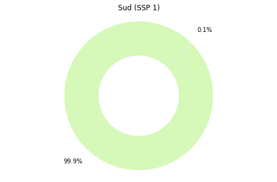

# Codi creat durant la part pràctica
## Anàlisi de les dades de reanàlisi
Primers exercicis de construcció de mapes i gràfics. A continuació es mostra el codi creat i utilitzat per dur a terme la següent pràctica.

### Introducció a la creació de gràfics

Importació de les biblioteques


```python
# import modules
import numpy as np
import matplotlib as mpl
from netCDF4 import Dataset as ncread
from mpl_toolkits.basemap import Basemap
import matplotlib.pyplot as plt
%matplotlib inline

```

Importació de l'arxiu de dades de temperatura i definició de totes les variables que s'utilitzaran.


```python

data_path = "C:/Users/alumne/Desktop/Dades/"#Aquí s'ha d'introduir l'adreça de l'arxiu de dades, diferent en cada cas.
nc = ncread(data_path+'e20C_Amon_tas_190001-201012.nc')
#Definir les variables
t = nc.variables['2T_GDS4_SFC'][:]
lon = nc.variables['g4_lon_2'][:]
lat = nc.variables['g4_lat_1'][:]
ni=len(lon)
ny=len(lat)
nyr=int(len(t[:,0,0])/12)

```

Reestructuració de la matriu de temperatura


```python
t = np.reshape(t,(nyr,12,ny,ni))
```

#### Temperatura durant l'any 2002

Càlcul de la temperatura mitjana de cada mes.


```python
t_j=t[102,:,:,:]-273.15#S'escull l'any 2002.
#t_g=np.mean(t_j,axis=0)#Mitjana en totes les latituds.
t_g=np.mean(t_j,axis=2)#Mitjana de tots els resultats anteriors i a graus centígrads.
coslat=np.cos(np.radians(lat))
suma=np.sum(coslat)
t_g_a=np.empty(12)
t_g_a.fill(np.nan)
for it in range(12):
    t_g_a[it]=np.sum(coslat[:]*t_g[it,:])/suma
```

Creació del gràfic


```python
months=np.arange(12)+1
fig,ax1=plt.subplots(figsize=(8,5))
plt.plot(months,t_g_a)
plt.title('Evolució de la temperatura 2002',fontsize=14)
plt.xlabel('t(mesos)')
plt.ylabel('T (ºC)')
fig.savefig(data_path+'fig_i', bbox_inches='tight',dpi=400)
```


#### Comparació 2002-1900

Càlcul de la temperatura mitjana de cada mes i creació del gràfic.


```python
t_h=t[0,:,:,:]-273.15
t_i=np.mean(t_h,axis=2)
t_i_a=np.empty(12)
t_i_a.fill(np.nan)
for it in range(12):
    t_i_a[it]=np.sum(coslat[:]*t_i[it,:])/suma

fig,ax1=plt.subplots(figsize=(8,5))
plt.plot(months,t_g_a)
plt.plot(months,t_i_a)
plt.title('Comparació temperatures 1900-2002',fontsize=14)
plt.xlabel('t (mesos)')
plt.ylabel('T (ºC)')

plt.legend(('2002', '1900'),
           shadow=True, handlelength=1.5, fontsize=12)
fig.savefig(data_path+'fig_ii', bbox_inches='tight',dpi=400)
```


Càlcul de la diferència de temperatura mitjana de l'any 2002 respecte l'any 1900. 


```python
t_i_a_a=np.nanmean(t_i_a, axis=0)
t_g_a_a=np.nanmean(t_g_a, axis=0)
t_gi_a_a=t_g_a_a-t_i_a_a
print('Difèrencia de temperatures mitjanes:',t_gi_a_a,'ºC')
```

    Difèrencia de temperatures mitjanes: 0.6811817487080898 ºC
    

#### Representació per latituds

Visualització de totes les latituds de les quals se'n disposen dades.


```python
print(lat)
```

    [ 89.14152     88.02943     86.910774    85.79063     84.66992
      83.54895     82.42782     81.306595    80.18531     79.06398
      77.94263     76.82124     75.699844    74.57843     73.45701
      72.33558     71.214134    70.09269     68.97124     67.849785
      66.728325    65.606865    64.4854      63.363934    62.242462
      61.12099     59.99952     58.878044    57.75657     56.635094
      55.513615    54.392136    53.270657    52.149174    51.027695
      49.90621     48.78473     47.663246    46.541763    45.42028
      44.298794    43.17731     42.055824    40.934338    39.81285
      38.691364    37.56988     36.44839     35.326904    34.205418
      33.08393     31.962444    30.840956    29.719467    28.597979
      27.47649     26.355003    25.233515    24.112024    22.990536
      21.869047    20.747559    19.62607     18.50458     17.383091
      16.2616      15.140112    14.018622    12.897133    11.775643
      10.654153     9.532663     8.411174     7.2896843    6.1681943
       5.0467043    3.9252145    2.8037248    1.6822349    0.56074494
      -0.56074494  -1.6822349   -2.8037248   -3.9252145   -5.0467043
      -6.1681943   -7.2896843   -8.411174    -9.532663   -10.654153
     -11.775643   -12.897133   -14.018622   -15.140112   -16.2616
     -17.383091   -18.50458    -19.62607    -20.747559   -21.869047
     -22.990536   -24.112024   -25.233515   -26.355003   -27.47649
     -28.597979   -29.719467   -30.840956   -31.962444   -33.08393
     -34.205418   -35.326904   -36.44839    -37.56988    -38.691364
     -39.81285    -40.934338   -42.055824   -43.17731    -44.298794
     -45.42028    -46.541763   -47.663246   -48.78473    -49.90621
     -51.027695   -52.149174   -53.270657   -54.392136   -55.513615
     -56.635094   -57.75657    -58.878044   -59.99952    -61.12099
     -62.242462   -63.363934   -64.4854     -65.606865   -66.728325
     -67.849785   -68.97124    -70.09269    -71.214134   -72.33558
     -73.45701    -74.57843    -75.699844   -76.82124    -77.94263
     -79.06398    -80.18531    -81.306595   -82.42782    -83.54895
     -84.66992    -85.79063    -86.910774   -88.02943    -89.14152   ]
    

Definició de les variables que correspondran a les latituds de l'hemisferi nord i les de l'hemisferi sud.


```python
l90s = (np.abs(lat+90)).argmin()#La variable agafa el valor de la latitud que més s'acosti a -45.(Hemisferi sud) 
l1s = (np.abs(lat+1)).argmin()
l1n = (np.abs(lat-1)).argmin()#El mateix però a l'hemisferi nord.
l90n = (np.abs(lat-90)).argmin()#El mateix però a l'hemisferi nord.
latn=lat[l90n:l1n]
lats=lat[l1s:l90s]
```

Càlcul de les temperatures mitjanes mensuals de l'any 1986 a l'hemisferi nord.


```python
t_m=t[86,:,l90n:l1n,:]-273.15 #Definir la zona i l'any que volem.
t_m_a=np.mean(t_m,axis=2)
t_m_a_a=np.empty(12)
t_m_a_a.fill(np.nan)
coslatn=np.cos(np.radians(latn))
suman=np.sum(coslatn)
for it in range(12):
    t_m_a_a[it]=np.sum(coslatn[:]*t_m_a[it,:])/suman


```

Càlcul de les temperatures mitjanes mensuals de l'any 1986 a l'hemisferi sud i representació dels resultats.


```python
t_n=t[86,:,l1s:l90s,:]#Definir la zona i l'any que volem.
t_n_a=np.mean(t_n,axis=2)-273.15#Càlcul de la mitjana de totes les latituds.
t_n_a_a=np.empty(12)
t_n_a_a.fill(np.nan)
coslats=np.cos(np.radians(lats))
sumas=np.sum(coslats)
for it in range(12):
    t_n_a_a[it]=np.sum(coslats[:]*t_n_a[it,:])/sumas

#Representar les dades:
fig,ax1=plt.subplots(figsize=(8,5))
plt.plot(months,t_n_a_a)
plt.plot(months,t_m_a_a)
plt.title('Evolució temperatura 1986 (hemisferis)',fontsize=14)
plt.xlabel('t (mesos)')
plt.ylabel('T (ºC)')
plt.legend(('Sud', 'Nord'),
           shadow=True, handlelength=1.5, fontsize=12)
fig.savefig(data_path+'fig_iii', bbox_inches='tight',dpi=400)
```


### Càlcul d'anomalies

Càlcul de les anomalies segons la formula explicada al treball.


```python
t_anom=np.zeros((111,12,ny,ni))#Construcció d'una matriu amb les mateixes dimensions de t. La matriu només conté zeros.
t_anom.fill(np.nan)#Omplir l'array de "NaNs".
clim=np.nanmean(t,axis=0)#Fa la mitjana de temperatura de tots els anys tenint en compte tots els mesos, longituds i latituds.
for iyr in range(nyr):#En aquest bucle apliquem la formula explicada anteriorment. El bucle es repetirà tantes vegades com el nombre d'anys (111).
       for imon in range(12):#En cada bucle es repetirà 12 vegades la fómula explicada.
        t_anom[iyr,imon,:,:]=t[iyr,imon,:,:]-clim[imon,:,:]#Execució de la fórmula
```

Càlcul de les anomalies entre 1900 i 2010.


```python
t_anom_a=np.nanmean(t_anom,axis=3)#mitjana de les longituds.
t_anom_a_a=np.empty((111,12,))
t_anom_a_a.fill(np.nan)
for it in range(111):
     for imon in range(12):
        t_anom_a_a[it,imon]=np.sum(coslat[:]*t_anom_a[it,imon,:])/suma

t_anom_a_b=np.nanmean(t_anom_a_a, axis=1)
```

Visualització dels resultats.


```python
fig,ax1=plt.subplots(figsize=(8,5))
plt.plot(years,t_anom_a_b, color='k')
plt.title('Anomalies 1900-2010',fontsize=14)
plt.xlabel('t (anys)')
plt.ylabel('T (ºC)')

fig.savefig(data_path+'fig_19', bbox_inches='tight',dpi=400)
```


#### Visualització d'anomalies en mapes 

Càlcul de les anomalies mitjanes de l'any 2010.


```python
t_anom_b=t_anom[110,:,:,:]
t_anom_b_a=np.nanmean(t_anom_b,axis=0)
var=t_anom_b_a
```

Creació del mapa


```python

dpi = 101

fig = plt.figure(figsize=(1100/dpi, 1100/dpi), dpi=dpi)
ax = fig.add_axes([0.1,0.1,0.8,0.9])

#----Creació del mapa
map = Basemap(projection='cyl',llcrnrlat= -90.,urcrnrlat= 90.,\
resolution='c', llcrnrlon=-180.,urcrnrlon=180.,lon_0=0.,
lat_0=0.,)

#----Dibuixar les costes, estats, països...
map.drawcoastlines()
#map.drawstates()
#map.fillcontinents()
map.drawcountries(zorder=100)

#----Dibuixar paral·lels i meridians
map.drawparallels(np.arange( -80., 90.,20.),labels=[1,0,0,0],fontsize=14)
map.drawmeridians(np.arange(-180,180.,30.),labels=[0,0,0,1],fontsize=14)

#----*DEFINIR LES COORDENADES X I Y DEL MAPA COM A LES LONGITUDS I LES LATITUDS DE L'ARXIU DE DADES.
x, y = map(*np.meshgrid(lon,lat))
x1, y1 = map(*np.meshgrid(lon-359,lat))
#-- contour levels
#clevs = np.arange(-2,2,.2)*1e7
#clevs=np.arange(13)*2-12
clevs=np.arange(8)*2-7

#----**PINTAR ELS MAPES
cnplot = map.contourf(x1,y1,var,cmap=plt.cm.bwr,levels=clevs)
cnplot = map.contourf(x,y,var,cmap=plt.cm.bwr,levels=clevs)
cs2 = map.contour(x1, y1, var, (0,), colors = 'k', linewidths = 1,levels=clevs)
cs2 = map.contour(x, y, var, (0,), colors = 'k', linewidths = 1,levels=clevs)
#cs2 = map.contour(x, y, var, colors = 'k', linewidths = 1,levels=clevs)
#plt.clabel(cs2, fmt = '%d', colors = 'C',fontsize=12)
#cnplot = map.contourf(x,y,var,cmap=plt.cm.coolwarm)

#----Creació d'una barra de colors
cbar = map.colorbar(cnplot,location='bottom',pad="10%") #-- pad: distància entre el mapa i la barra de colors
cbar.set_label('$ºC$',fontsize=14) #-- Títol de la barra de colors


#----Títol
#plt.title('2000-2010 minus 1900-1910',fontsize=14)
plt.title('Anomalia 2010',fontsize=14)
plt.plot(years, t_anom_a_a[:,0], color='k')
fig.savefig(data_path+'fig_20', bbox_inches='tight',dpi=400)
```

    c:\users\alumne\anaconda3\lib\site-packages\ipykernel_launcher.py:9: MatplotlibDeprecationWarning: 
    The dedent function was deprecated in Matplotlib 3.1 and will be removed in 3.3. Use inspect.cleandoc instead.
      if __name__ == '__main__':
    c:\users\alumne\anaconda3\lib\site-packages\ipykernel_launcher.py:15: MatplotlibDeprecationWarning: 
    The dedent function was deprecated in Matplotlib 3.1 and will be removed in 3.3. Use inspect.cleandoc instead.
      from ipykernel import kernelapp as app
    


```python
max_2010=np.amax(var)
print('Anomalia màxima:',max_2010,'ºC')
```

    Anomalia màxima: 6.624153137207031 ºC
    


```python
min_2010=np.amin(var)
print('Anomalia mínima:',min_2010,'ºC')
```

    Anomalia mínima: -4.01034418741862 ºC
    

#### Visualització de "el Niño"

Definició de l'anomalia que es mostrarà.


```python
t_nino=t_anom[97,11,:,:]
var=t_nino
```

Creació del mapa i visualització.


```python
dpi = 101
fig = plt.figure(figsize=(1100/dpi, 1100/dpi), dpi=dpi)
ax = fig.add_axes([0.1,0.1,0.8,0.9])

#----Creació del mapa
map = Basemap(projection='cyl',llcrnrlat= -90.,urcrnrlat= 90.,\
resolution='c', llcrnrlon=-180.,urcrnrlon=180.,lon_0=0.,
lat_0=0.,)

#----Dibuixar les costes, estats, països...
map.drawcoastlines()
#map.drawstates()
#map.fillcontinents()
map.drawcountries(zorder=100)

#----Dibuixar paral·lels i meridians
map.drawparallels(np.arange( -80., 90.,20.),labels=[1,0,0,0],fontsize=14)
map.drawmeridians(np.arange(-180,180.,30.),labels=[0,0,0,1],fontsize=14)

#----*DEFINIR LES COORDENADES X I Y DEL MAPA COM A LES LONGITUDS I LES LATITUDS DE L'ARXIU DE DADES.
x, y = map(*np.meshgrid(lon,lat))
x1, y1 = map(*np.meshgrid(lon-359,lat))
#-- contour levels
#clevs = np.arange(-2,2,.2)*1e7
#clevs=np.arange(13)*2-12
clevs=np.arange(14)*2-13

#----**PINTAR ELS MAPES
cnplot = map.contourf(x1,y1,var,cmap=plt.cm.bwr,levels=clevs)
cnplot = map.contourf(x,y,var,cmap=plt.cm.bwr,levels=clevs)
cs2 = map.contour(x1, y1, var, (0,), colors = 'k', linewidths = 1,levels=clevs)
cs2 = map.contour(x, y, var, (0,), colors = 'k', linewidths = 1,levels=clevs)
#cs2 = map.contour(x, y, var, colors = 'k', linewidths = 1,levels=clevs)
#plt.clabel(cs2, fmt = '%d', colors = 'C',fontsize=12)
#cnplot = map.contourf(x,y,var,cmap=plt.cm.coolwarm)

#----Creació d'una barra de colors
cbar = map.colorbar(cnplot,location='bottom',pad="10%") #-- pad: distància entre el mapa i la barra de colors
cbar.set_label('$ºC$',fontsize=14) #-- Títol de la barra de colors


#----Títol
#plt.title('2000-2010 minus 1900-1910',fontsize=14)
plt.title('NIÑO 1997',fontsize=14)
fig.savefig(data_path+'fig_21', bbox_inches='tight',dpi=400)
```

    c:\users\alumne\anaconda3\lib\site-packages\ipykernel_launcher.py:8: MatplotlibDeprecationWarning: 
    The dedent function was deprecated in Matplotlib 3.1 and will be removed in 3.3. Use inspect.cleandoc instead.
      
    c:\users\alumne\anaconda3\lib\site-packages\ipykernel_launcher.py:14: MatplotlibDeprecationWarning: 
    The dedent function was deprecated in Matplotlib 3.1 and will be removed in 3.3. Use inspect.cleandoc instead.
      
    


### Càlcul de la diferència de temperatura entre 1900-1909 i 2001-2010

Definició de les variables


```python
t_j_i=t[0:10,:,:,:]
t_j_i=np.mean(t_j_i,axis=1)
t_j_i=np.mean(t_j_i,axis=0)

t_j_f=t[102:112,:,:,:]
t_j_f=np.mean(t_j_f,axis=1)
t_j_f=np.mean(t_j_f,axis=0)

dif= t_j_f - t_j_i
```

Representació en el mapa


```python

#----Definim la variable que volem representar.
var=dif

dpi = 101
fig = plt.figure(figsize=(1100/dpi, 1100/dpi), dpi=dpi)
ax = fig.add_axes([0.1,0.1,0.8,0.9])

#----Creació del mapa
map = Basemap(projection='cyl',llcrnrlat= -90.,urcrnrlat= 90.,\
resolution='c', llcrnrlon=-180.,urcrnrlon=180.,lon_0=0.,
lat_0=0.,)

#----Dibuixar les costes, estats, països...
map.drawcoastlines()
#map.drawstates()
#map.fillcontinents()
map.drawcountries(zorder=100)

#----Dibuixar paral·lels i meridians
map.drawparallels(np.arange( -80., 90.,20.),labels=[1,0,0,0],fontsize=14)
map.drawmeridians(np.arange(-180,180.,30.),labels=[0,0,0,1],fontsize=14)

#----DEFINIR LES COORDENADES X I Y DEL MAPA COM A LES LONGITUDS I LES LATITUDS DE L'ARXIU DE DADES.
x, y = map(*np.meshgrid(lon,lat))
x1, y1 = map(*np.meshgrid(lon-359,lat))
#-- contour levels
#clevs = np.arange(-15,15,.2)*2
#clevs=np.arange(13)*2-12
clevs=np.arange(8)*2-7


#----PINTAR ELS MAPES
cnplot = map.contourf(x1,y1,var,cmap=plt.cm.bwr,levels=clevs)
cnplot = map.contourf(x,y,var,cmap=plt.cm.bwr,levels=clevs)
cs2 = map.contour(x1, y1, var, (0,), colors = 'k', linewidths = 1,levels=clevs)
cs2 = map.contour(x, y, var, (0,), colors = 'k', linewidths = 1,levels=clevs)
#cs2 = map.contour(x, y, var, colors = 'k', linewidths = 1,levels=clevs)
#plt.clabel(cs2, fmt = '%d', colors = 'C',fontsize=12)
#cnplot = map.contourf(x,y,var,cmap=plt.cm.coolwarm)

#----Creació d'una barra de colors
cbar = map.colorbar(cnplot,location='bottom',pad="10%") #-- pad: distància entre el mapa i la barra de colors
cbar.set_label('$ºC$',fontsize=14) #-- Títol de la barra de colors


#----Títol
plt.title('(2001-2010)- (1901-1909)',fontsize=14)
fig.savefig(data_path+'fig_22', bbox_inches='tight',dpi=400)

```


Visualització de l'anomalia màxima i mínima.


```python
print('Diferència màxima:',np.max(dif),'ºC')
print('Diferència mínima:',np.min(dif),'ºC')
```

    Diferència màxima: 5.6873474 ºC
    Diferència mínima: -1.776947 ºC
    

Anomalies mitjanes a cada hemisferi.


```python
difn=dif[l90n:l1n,:]
difn=np.nanmean(difn, axis=1)
coslatn=np.cos(np.radians(latn))
suman=np.sum(coslatn)
difn=np.sum(coslatn[:]*difn[:])/suman
print('Diferència hemisfèri Nord:',difn,'ºC')

```

    Diferència hemisfèri Nord: 1.0698409 ºC
    


```python
difs=dif[l1s:l90s,:]
difs=np.nanmean(difs, axis=1)
coslats=np.cos(np.radians(lats))
sumas=np.sum(coslats)
difs=np.sum(coslats[:]*difs[:])/sumas
print('Diferència hemisfèri Sud:',difs,'ºC')
```

    Diferència hemisfèri Sud: 0.943146 ºC
    

#### Gràfics per analitzar els mapes

Creació del gràfic de les anomalies de tot el planeta.


```python
aug0=0
aug1=0
aug2=0
aug3=0
aug4=0
aug5=0
dis=0
for ilat in range(160):
    for ilon in range(320):
        if dif[ilat,ilon]<0:
            dis=dis+1
            
        if 1>dif[ilat,ilon]>0:
            aug0=aug0+1
            
        if 2>dif[ilat,ilon]>=1:
            aug1=aug1+1
            
        if 3>dif[ilat,ilon]>=2:
            aug2=aug2+1
            
        if 4>dif[ilat,ilon]>=3:
            aug3=aug3+1
            
        if dif[ilat,ilon]>=4:
            aug4=aug4+1

            

dis=dis*100/51200                
aug0=aug0*100/51200
aug1=aug1*100/51200
aug2=aug2*100/51200
aug3=aug3*100/51200
aug4=aug4*100/51200


total=dis+aug0+aug1+aug2+aug3+aug4
labels = 'Disminueix:', 'Entre 0 i 1ºC','Entre 1 i 2ºC', 'Entre 2 i 3ºC','Entre 3 i 4ºC', 'Més de 4ºC'
sizes = [dis, aug0, aug1, aug2, aug3, aug4,]

colors = ['#d6f8b8','#daf1f9','#a4d7e1','#f6edcf','#f0dab1','#daa592',]
fig1, ax1 = plt.subplots(figsize=(8,5))
plt.pie(sizes, explode=None, labels=None, autopct='%1.1f%%',
        shadow=None, startangle=0, pctdistance=1.15, radius=5,colors=colors)
plt.axis('equal')  # Equal aspect ratio ensures that pie is drawn as a circle.

plt.legend(labels,
          title="Valors de l'anomalia",
          loc="center left",
          bbox_to_anchor=(1, 0, 0.5, 1))

#draw circle
centre_circle = plt.Circle((0,0),2.70,fc='white')
fig = plt.gcf()
fig.gca().add_artist(centre_circle)

plt.title("Anomalia en les dades de reanàlisi",
         loc='right')


plt.show()
fig.savefig(data_path+'fig_23', bbox_inches='tight',dpi=400)

```


Creació dels gràfics d'anomalies per hemisferis.


```python
aug0n=0
aug1n=0
aug2n=0
aug3n=0
aug4n=0
disn=0
for ilat in range(80):
    for ilon in range(320):
        if dif[ilat,ilon]<0:
            disn=disn+1
            
        if 1>dif[ilat,ilon]>0:
            aug0n=aug0n+1
            
        if 2>dif[ilat,ilon]>=1:
            aug1n=aug1n+1
            
        if 3>dif[ilat,ilon]>=2:
            aug2n=aug2n+1
            
        if 4>dif[ilat,ilon]>=3:
            aug3n=aug3n+1
            
        if dif[ilat,ilon]>=4:
            aug4n=aug4n+1

            

disn=disn*100/25600                
aug0n=aug0n*100/25600
aug1n=aug1n*100/25600
aug2n=aug2n*100/25600
aug3n=aug3n*100/25600
aug4n=aug4n*100/25600


total=disn+aug0n+aug1n+aug2n+aug3n+aug4n
labels = 'Disminueix:', 'Entre 0 i 1ºC','Entre 1 i 2ºC', 'Entre 2 i 3ºC','Entre 3 i 4ºC', 'Més de 4ºC'
sizes = [disn, aug0n, aug1n, aug2n, aug3n, aug4n,]


fig1, ax1 = plt.subplots(figsize=(8,5))
plt.pie(sizes, explode=None, labels=None, autopct='%1.1f%%',
        shadow=None, startangle=0, pctdistance=1.37, radius=5,colors=colors)
plt.axis('equal')  # Equal aspect ratio ensures that pie is drawn as a circle.

plt.legend(labels,
          title="Valors de l'anomalia",
          loc="center left",
          bbox_to_anchor=(1, 0, 0.5, 1))

#draw circle
centre_circle = plt.Circle((0,0),2.70,fc='white')
fig = plt.gcf()
fig.gca().add_artist(centre_circle)

plt.title("Nord",
         loc='right')
fig.savefig(data_path+'fig_24b', bbox_inches='tight',dpi=400)

aug0s=0
aug1s=0
aug2s=0
aug3s=0
aug4s=0
diss=0
for ilat in range(80):
    for ilon in range(320):
        if dif[ilat+80,ilon]<0:
            diss=diss+1
            
        if 1>dif[ilat+80,ilon]>0:
            aug0s=aug0s+1
            
        if 2>dif[ilat+80,ilon]>=1:
            aug1s=aug1s+1
            
        if 3>dif[ilat+80,ilon]>=2:
            aug2s=aug2s+1
            
        if 4>dif[ilat+80,ilon]>=3:
            aug3s=aug3s+1
            
        if dif[ilat+80,ilon]>=4:
            aug4s=aug4s+1

            

diss=diss*100/25600                
aug0s=aug0s*100/25600
aug1s=aug1s*100/25600
aug2s=aug2s*100/25600
aug3s=aug3s*100/25600
aug4s=aug4s*100/25600


total=diss+aug0s+aug1s+aug2s+aug3s+aug4s
labels = 'Disminueix:', 'Entre 0 i 1ºC','Entre 1 i 2ºC', 'Entre 2 i 3ºC','Entre 3 i 4ºC', 'Més de 4ºC'
sizes = [diss, aug0s, aug1s, aug2s, aug3s, aug4s,]


fig1, ax1 = plt.subplots(figsize=(8,5))
plt.pie(sizes, explode=None, labels=None, autopct='%1.1f%%',
        shadow=None, startangle=0, pctdistance=1.25, radius=5,colors=colors)
plt.axis('equal')  # Equal aspect ratio ensures that pie is drawn as a circle.


#draw circle
centre_circle = plt.Circle((0,0),2.70,fc='white')
fig = plt.gcf()
fig.gca().add_artist(centre_circle)

plt.title("Sud",
         loc='right')

plt.show()
fig.savefig(data_path+'fig_24a', bbox_inches='tight',dpi=400)
```


## Anàlisi de dades històriques i d'escenaris
En el següent apartat es treballarà en la construcció de mapes i gràfics a partir de dades històriques (1850-2014) i dades de tres escenaris diferents SSP1 (o 126), SSP 2 (o 245) i SSP 3 (o 585). 

Importació de les biblioteques i de les dades.


```python
# import modules
import numpy as np
import matplotlib as mpl
from netCDF4 import Dataset as ncread
from mpl_toolkits.basemap import Basemap
import matplotlib.pyplot as plt
%matplotlib inline
```


```python
#DADES HISTÒRIQUES
data_path= "C:/Users/alumne/Desktop/Dades/"#Aquest paràmetre varia segons la situació de l'arxiu de dades de l'usuari.
nc0 = ncread(data_path+'tas_1850-2014_historical.nc')
#Definim les variables
u0 = nc0.variables['tas'][:]
lon0 = nc0.variables['lon'][:]
lat0 = nc0.variables['lat'][:]
ni0=len(lon0)
ny0=len(lat0)
nyr0=int(len(u0[:,0,0,0])/12)
nt0=len(u0[:,0,0,0])
u0= np.reshape(u0,(nyr0,12,10,ny0,ni0))
u=u0[50:161,:,:,:,:]
nc0.close()

#DADES DE REANÀLISI
nc = ncread(data_path+'e20C_Amon_tas_190001-201012.nc')
#Definim les variables
t = nc.variables['2T_GDS4_SFC'][:]
lon = nc.variables['g4_lon_2'][:]
lat = nc.variables['g4_lat_1'][:]
ni=len(lon)
ny=len(lat)
nyr=int(len(t[:,0,0])/12)
nt=len(t[:,0,0])
t = np.reshape(t,(nyr,12,ny,ni))
nc.close()


#ESCENARI SSP1(126)
nc126 = ncread(data_path+'tas_2015-2100_ssp126.nc')
#Definim les variables
t126= nc126.variables['tas'][:]
lon126 = nc126.variables['lon'][:]
lat126 = nc126.variables['lat'][:]
ni126 =len(lon126)
ny126 =len(lat126)
nyr126 =int(len(t126[:,0,0,0])/10)
t126 = np.reshape(t126,(nyr126,10,12,ny126,ni126))
nc126.close()


#ESCENARI SSP2
nc245 = ncread(data_path+'tas_2015-2100_ssp245.nc')
#Definim les variables
t245= nc245.variables['tas'][:]
lon245 = nc245.variables['lon'][:]
lat245 = nc245.variables['lat'][:]
ni245 =len(lon245)
ny245 =len(lat245)
nyr245 =int(len(t245[:,0,0,0])/12)
nt245=len(t245[:,0,0,0])
t245= np.reshape(t245,(nyr245,12,10,ny245,ni245))
nc245.close()

#ESCENARI SSP5
nc585 = ncread(data_path+'tas_2015-2100_ssp585.nc')
#Definim les variables
t585= nc585.variables['tas'][:]
lon585 = nc585.variables['longitude'][:]
lat585 = nc585.variables['latitude'][:]
ni585 =len(lon585)
ny585 =len(lat585)
nyr585 =int(len(t585[:,0,0,0])/12)
nt585 =len(t585[:,0,0,0])
t585 = np.reshape(t585,(nyr585,12,10,ny585,ni585))
nc585.close()


```

### Comparació de les dades històriques i les de reanàlisi.

Càlcul dels valors i de les mitjanes.


```python
u=u0[50:162,:,:,:,:]
u1_0 =np.nanmean(u,axis=2)
u1_0 =np.nanmean(u1_0,axis=1)
u1_0 =np.nanmean(u1_0,axis=2)-273.15
coslat0=np.cos(np.radians(lat0))
suma0=np.sum(coslat0)
ug=np.empty(111)
ug.fill(np.nan)
for it in range(111):
    ug[it]=np.sum(coslat0[:]*u1_0[it,:])/suma0

t1=t[:,:,:,:]
t1_0 =np.nanmean(t1,axis=1)
t1_0 =np.nanmean(t1_0,axis=2)-273.15
coslat=np.cos(np.radians(lat))
suma=np.sum(coslat)
tg=np.empty(111)
tg.fill(np.nan)
for it in range(111):
    tg[it]=np.sum(coslat[:]*t1_0[it,:])/suma
tg_mean=np.nanmean(tg)
ug_mean=np.nanmean(ug)
```

Visualització dels resultats.


```python
years=np.arange(111)+1900
fig,ax1=plt.subplots(figsize=(8,5))
plt.plot(years,tg, color='g')
print("Temperatura mitjana històric:",ug_mean,"ºC")
print("Temperatura mitjana reanàlisi:",tg_mean,"ºC")
plt.plot(years,ug,color='b')
plt.title('Comparació històric-reanàlisi',fontsize=14)
plt.xlabel('t (anys)')
plt.ylabel('T (ºC)')
plt.legend(('Reanàlisi', 'Històric'),
shadow=True, handlelength=1.5, fontsize=12)
fig.savefig(data_path+'Evolució_temperatura.png', bbox_inches='tight',dpi=400)
difmean=ug_mean-tg_mean
print("Diferència:",difmean,"ºC")
```

    Temperatura mitjana històric: 13.904147874497543 ºC
    Temperatura mitjana reanàlisi: 13.128585342888359 ºC
    Diferència: 0.7755625316091841 ºC
    


Definició de les latituds que corresponen a cada hemisferi


```python
l90s = (np.abs(lat+90)).argmin()#La variable agafa el valor de la latitud que més s'acosti a -45.(Hemisferi sud) 
l1s = (np.abs(lat+1)).argmin()
l1n = (np.abs(lat-1)).argmin()#El mateix però a l'hemisferi nord.
l90n = (np.abs(lat-90)).argmin()#El mateix però a l'hemisferi nord.
latn=lat[l90n:l1n]
lats=lat[l1s:l90s]
```

### Anàlisi dels escenaris

#### Representació històric-escenaris.

Càlcul del recorregut dels tres escenaris en el període (2015-2100).


```python
coslat245=np.cos(np.radians(lat245))
suma245=np.sum(coslat245)
s1=t245[:,:,:,:,:]
s1_0 =np.nanmean(s1,axis=1)
s1_0 =np.nanmean(s1_0,axis=1)
s1_0 =np.nanmean(s1_0,axis=2)-273.15
s1_0_0=np.empty(86)
s1_0_0.fill(np.nan)
for it in range(86):
    s1_0_0[it]=np.sum(coslat245[:]*s1_0[it,:])/suma245
ssp2=np.zeros((151))
ssp2.fill(np.nan)
ssp2[65:151]=s1_0_0

coslat585=np.cos(np.radians(lat585))
suma585=np.sum(coslat585)
t2=t585[:,:,:,:,:]
t2_0 =np.nanmean(t2,axis=1)
t2_0 =np.nanmean(t2_0,axis=1)
t2_0 =np.nanmean(t2_0,axis=2)-273.15
t2_0_0=np.empty(86)
t2_0_0.fill(np.nan)
for it in range(86):
    t2_0_0[it]=np.sum(coslat585[:]*t2_0[it,:])/suma585

ssp5=np.zeros((151))
ssp5.fill(np.nan)
ssp5[65:151]=t2_0_0

coslat126=np.cos(np.radians(lat126))
suma126=np.sum(coslat126)
c1=t126[:,:,:,:,:]
c1_0 =np.nanmean(c1,axis=2)
c1_0 =np.nanmean(c1_0,axis=1)
c1_0 =np.nanmean(c1_0,axis=2)-273.15
c1_0_0=np.empty(86)
c1_0_0.fill(np.nan)
for it in range(86):
    c1_0_0[it]=np.sum(coslat126[:]*c1_0[it,:])/suma126

ssp1=np.zeros((151))
ssp1.fill(np.nan)
ssp1[65:151]=c1_0_0


```

Càlcul de l'històric i representació del resultat


```python
u2_0 =np.nanmean(u0,axis=1)
u2_0 =np.nanmean(u2_0,axis=1)
u2_0 =np.nanmean(u2_0,axis=2)-273.15
#nyr0,12,10,ny0,ni0
u2_0_0=np.empty(166)
u2_0_0.fill(np.nan)
for it in range(165):
    u2_0_0[it]=np.sum(coslat0[:]*u2_0[it,:])/suma0
years=np.arange(151)+1950
hist=np.zeros((151))
hist.fill(np.nan)
hist[0:66]=u2_0_0[100:166]

fig,ax1=plt.subplots(figsize=(8,5))
plt.plot(years,ssp1,color='g')
plt.plot(years,ssp2,color='b')
plt.plot(years,ssp5,color='r')
plt.plot(years,hist,color='k')
plt.xlim(1950,2100)
plt.ylim(13,22)
plt.title('Escenaris i Històric',fontsize=14)
plt.xlabel('t (anys)')
plt.ylabel('T (ºC)')
plt.legend(('SSP 1 (126)','SSP 2 (245)','SSP 5 (585)','Històric'),
shadow=True, handlelength=1.5, fontsize=12)

fig.savefig(data_path+'escenaris', bbox_inches='tight',dpi=400)
```


### Escenari SSP 1 (126)

#### Mapa de la diferència (2091-2100)-(1900-1909)

Execució de la resta.


```python
u3=u0[50:60,:,:,:,:]
u3_0=np.nanmean(u3,axis=2)
u3_1=np.nanmean(u3_0,axis=0)
u3_0=np.nanmean(u3_1,axis=0)
u3_2=np.nanmean(u3_1,axis=2)
u3_2_0=np.empty(12)
u3_2_0.fill(np.nan)
for it in range(12):
    u3_2_0[it]=np.sum(coslat0[:]*u3_2[it,:])/suma0

#126
c2=t126[76:86,:,:,:,:]
c2_0 =np.nanmean(c2,axis=1)
c2_1 =np.nanmean(c2_0,axis=0)
c2_0 =np.nanmean(c2_1,axis=0)
c3_2=np.nanmean(c2_1,axis=2)
c3_2_0=np.empty(12)
c3_2_0.fill(np.nan)
for it in range(12):
    c3_2_0[it]=np.sum(coslat126[:]*c3_2[it,:])/suma126

dif126= c2_0 - u3_0
dif1=c3_2_0-u3_2_0
anom1=np.nanmean(dif1,axis=0)
print("Anomalia en l'escenari SSP 1:",anom1,"ºC")

```

    Anomalia en l'escenari SSP 1: 2.80741614630891 ºC
    

Representació de l'anomalia en forma de mapa


```python
var=dif126

dpi = 101
fig = plt.figure(figsize=(1100/dpi, 1100/dpi), dpi=dpi)
ax = fig.add_axes([0.1,0.1,0.8,0.9])

#----Creació del mapa
map = Basemap(projection='cyl',llcrnrlat= -88.,urcrnrlat= 88.,\
resolution='c', llcrnrlon=-180.,urcrnrlon=180.,lon_0=0.,
lat_0=0.,)

#----Dibuixar les costes, estats, països...
map.drawcoastlines()
#map.drawstates()
#map.fillcontinents()
map.drawcountries(zorder=100)

#----Dibuixar paral·lels i meridians
map.drawparallels(np.arange( -80., 90.,20.),labels=[1,0,0,0],fontsize=14)
map.drawmeridians(np.arange(-180,180.,30.),labels=[0,0,0,1],fontsize=14)

#----DEFINIR LES COORDENADES X I Y DEL MAPA COM A LES LONGITUDS I LES LATITUDS DE L'ARXIU DE DADES.
x, y = map(*np.meshgrid(lon126,lat126))
x1, y1 = map(*np.meshgrid(lon126-357,lat126))
#-- contour levels
#clevs = np.arange(-15,15,.2)*2
#clevs=np.arange(13)*2-12
#clevs=np.arange(20)*2-19
clevs=np.arange(27)*2-26

#----PINTAR ELS MAPES
cnplot = map.contourf(x1,y1,var,cmap=plt.cm.bwr,levels=clevs)
cnplot= map.contourf(x,y,var,cmap=plt.cm.bwr,levels=clevs)
cs = map.contour(x1, y1, var, (0,), colors = 'k', linewidths = 0.5,levels=clevs)
cs = map.contour(x, y, var, (0,), colors = 'k', linewidths = 0.5,levels=clevs)
#cs2 = map.contour(x, y, var, colors = 'k', linewidths = 1,levels=clevs)
#plt.clabel(cs2, fmt = '%d', colors = 'C',fontsize=12)
#cnplot = map.contourf(x,y,var,cmap=plt.cm.coolwarm)

#----Creació d'una barra de colors
cbar = map.colorbar(cnplot,location='bottom',pad="10%") #-- pad: distància entre el mapa i la barra de colors
cbar.set_label('$ºC$',fontsize=14) #-- Títol de la barra de colors


#----Títol
plt.title('Escenari 126:(2091-2100)- (1900-1909)',fontsize=14)


fig.savefig(data_path+'Mapa resta 126', bbox_inches='tight',dpi=400)
```


Càlcul de l'anomalia màxima i mínima.


```python
print("Diferència màxima:",np.amax(dif126),"ºC")
print("Diferència mínima:",np.amin(dif126),"ºC")
```

    Diferència màxima: 17.912964 ºC
    Diferència mínima: 0.70654297 ºC
    

#### Comparació per mesos de la temperatura de l'any 2020 i la del 2100

Càlcul de les temperatures mitjanes mensuals de cadascun dels anys.


```python
c4=t126[5,:,:,:,:]
c4_0 =np.nanmean(c4,axis=0)
c4_0 =np.nanmean(c4_0,axis=2)
c4_0_0=np.empty(12)
c4_0_0.fill(np.nan)
for it in range(12):
    c4_0_0[it]=(np.sum(coslat126[:]*c4_0[it,:])/suma126)-273.15
    
c5=t126[85,:,:,:,:]
c5_0 =np.nanmean(c5,axis=0)
c5_0 =np.nanmean(c5_0,axis=2)
c5_0_0=np.empty(12)
c5_0_0.fill(np.nan)
for it in range(12):
    c5_0_0[it]=(np.sum(coslat126[:]*c5_0[it,:])/suma126)-273.15
```

Representació dels resultats.


```python
months=np.arange(12)+1
fig,ax1=plt.subplots(figsize=(8,5))
plt.plot(months,c4_0_0,color='k')
plt.plot(months,c5_0_0,color='g')

plt.title('Comparació entre els anys 2020 i 2100 (SSP 1)',fontsize=14)
plt.xlabel('t (mesos)')
plt.ylabel('T (ºC)')
plt.legend(('2019','2100',),
shadow=True, handlelength=1.5, fontsize=12)

fig.savefig(data_path+'compa2020-2100', bbox_inches='tight',dpi=400)
difmean20_100= np.nanmean(c5_0_0)-np.nanmean(c4_0_0)
print("Diferència de temperatura entre el 2020 i el 2100:",difmean20_100,"ºC")
```

    Diferència de temperatura entre el 2020 i el 2100: 0.9142132092999056 ºC
    


#### Anomalia mensual SSP 1 (126)

Representació de les anomalies que es produirien durant cada mes.


```python
months=np.arange(12)+1
fig,ax1=plt.subplots(figsize=(8,5))
plt.plot(months,dif1,color='k')

plt.title('Variació de les anomalies segons el mes (SSP 1)',fontsize=14)
plt.xlabel('t (mesos)')
plt.ylabel('T (ºC)')


fig.savefig(data_path+'var126', bbox_inches='tight',dpi=400)

```


#### Percentatges d'augment i disminució SSP 1 (126)

Càlcul dels gràfics de tot el planeta.


```python
aug0126=0
aug1126=0
aug2126=0
aug3126=0
aug4126=0
aug5126=0

for ilat in range(64):
    for ilon in range(128):          
        if 5>dif126[ilat,ilon]>0:
            aug0126=aug0126+1
            
        if 10>dif126[ilat,ilon]>=5:
            aug1126=aug1126+1
            
        if 15>dif126[ilat,ilon]>=10:
            aug2126=aug2126+1
            
        if dif126[ilat,ilon]>=15:
            aug3126=aug3126+1
            
  #      if dif126[ilat,ilon]>=4:
   #         aug4=aug4+1
        
    #    if dif126[ilat,ilon]<5:
     #       aug

            

              
aug0126=aug0126*100/8192
aug1126=aug1126*100/8192
aug2126=aug2126*100/8192
aug3126=aug3126*100/8192
#aug4=aug4*100/8192

labels =  'Entre 0 i 5ºC','Entre 5 i 10ºC', 'Entre 10 i 15ºC','Entre 15 i 20ºC'
sizes = [aug0126, aug1126, aug2126, aug3126,] #aug4,

colors = ['#d6f8b8','#daf1f9','#a4d7e1','#f6edcf','#f0dab1','#daa592',]
fig1, ax1 = plt.subplots(figsize=(8,5))
plt.pie(sizes, explode=None, labels=None, autopct='%1.1f%%',
        shadow=None, startangle=0, pctdistance=1.15, radius=5,colors=colors)
plt.axis('equal')  # Equal aspect ratio ensures that pie is drawn as a circle.

plt.legend(labels,
          title="Valors de l'anomalia",
          loc="center left",
          bbox_to_anchor=(1, 0, 0.5, 1))

#draw circle
centre_circle = plt.Circle((0,0),2.70,fc='white')
fig = plt.gcf()
fig.gca().add_artist(centre_circle)

plt.title("Percentatge d'anomalies (SSP 1)",
         loc='right')


plt.show()
fig.savefig(data_path+'fig_25', bbox_inches='tight',dpi=400)

```


#### Anomalies mitjanes i percentatges dels hemisferis

Definició de les latituds que corresponen a cada hemisferi.


```python
coslat126n=np.cos(lat126n)
l90s = (np.abs(lat+90)).argmin()#La variable agafa el valor de la latitud que més s'acosti a -45.(Hemisferi sud) 
l1s = (np.abs(lat+1)).argmin()
l1n = (np.abs(lat-1)).argmin()#El mateix però a l'hemisferi nord.
l90n = (np.abs(lat-90)).argmin()#El mateix però a l'hemisferi nord.
latn=lat[l90n:l1n]
lats=lat[l1s:l90s]
```

Càlcul de les anomalies per hemisferi.


```python

c6=dif126[33:65,:]

c6_0 =np.nanmean(c6,axis=1)
coslat126n=np.cos(np.radians(lat126[33:65]))
suma126n=np.sum(coslat126n)
c6_0_0=(np.sum(coslat126n[:]*c6_0[:])/suma126n)
print ('Nord:',c6_0_0,'ºC')
```

    Nord: 3.6481267714306966 ºC
    


```python
c7=dif126[0:33,:]
c7_0 =np.nanmean(c7,axis=1)
coslat126s=np.cos(np.radians(lat126[0:33]))
suma126s=np.sum(coslat126s)
c7_0_0=(np.sum(coslat126s[:]*c7_0[:])/suma126s)
print ('Sud:',c7_0_0,'ºC')
```

    Sud: 2.0447679448373433 ºC
    

Càlculs dels percentatges d'anomalia per cada hemisferi.


```python
aug0126n=0
aug1126n=0
aug2126n=0
aug3126n=0
aug4126n=0

for ilat in range(32):
    for ilon in range(128):
        if dif126[ilat+32,ilon]<5:
            aug0126n=aug0126n+1
            
        if 10>dif126[ilat+32,ilon]>=5:
            aug1126n=aug1126n+1
            
        if 15>dif126[ilat+32,ilon]>=10:
            aug2126n=aug2126n+1
            
        if 20>dif126[ilat+32,ilon]>=15:
            aug3126n=aug3126n+1

            


aug0126n=aug0126n*100/4096
aug1126n=aug1126n*100/4096
aug2126n=aug2126n*100/4096
aug3126n=aug3126n*100/4096
#aug4126n=aug4126n*100/4096


#total=disn+aug0n+aug1n+aug2n+aug3n+aug4n
labels = 'Entre 0 i 1ºC','Entre 1 i 2ºC', 'Entre 2 i 3ºC','Entre 3 i 4ºC', 'Més de 4ºC'
sizes = [aug0126n, aug1126n, aug2126n, aug3126n, ]


fig1, ax1 = plt.subplots(figsize=(8,5))
plt.pie(sizes, explode=None, labels=None, autopct='%1.1f%%',
        shadow=None, startangle=0, pctdistance=1.2, radius=5,colors=colors)
plt.axis('equal')  # Equal aspect ratio ensures that pie is drawn as a circle.


#draw circle
centre_circle = plt.Circle((0,0),2.70,fc='white')
fig = plt.gcf()
fig.gca().add_artist(centre_circle)

plt.title("Nord (SSP 1)",
         loc='center')
fig.savefig(data_path+'fig_25a', bbox_inches='tight',dpi=400)

aug0126s=0
aug1126s=0
aug2126s=0
aug3126s=0
aug4126s=0

for ilat in range(32):
    for ilon in range(128):         
        if dif126[ilat,ilon]<5:
            aug0126s=aug0126s+1
            
        if 10>dif126[ilat,ilon]>=5:
            aug1126s=aug1126s+1
            
        if 15>dif126[ilat,ilon]>=10:
            aug2126s=aug2126s+1
            
        if 20>dif126[ilat,ilon]>=15:
            aug3126s=aug3126s+1
            
        #if dif[ilat+32,ilon]>=20:
            #aug4126s=aug4126s+1

            

               
aug0126s=aug0126s*100/4096
aug1126s=aug1126s*100/4096
aug2126s=aug2126s*100/4096
aug3126s=aug3126s*100/4096
#aug4126s=aug4126s*100/4096


sizes = [aug0126s, aug1126s, ] #aug4126s,


fig1, ax1 = plt.subplots(figsize=(8,5))
plt.pie(sizes, explode=None, labels=None, autopct='%1.1f%%',
        shadow=None, startangle=45, pctdistance=1.25, radius=5,colors=colors)
plt.axis('equal')  # Equal aspect ratio ensures that pie is drawn as a circle.


#draw circle
centre_circle = plt.Circle((0,0),2.70,fc='white')
fig = plt.gcf()
fig.gca().add_artist(centre_circle)

plt.title("Sud (SSP 1)",
         loc='center')

plt.show()
fig.savefig(data_path+'fig_25b', bbox_inches='tight',dpi=400)
```





### Escenari SSP 2 (245)

#### Mapa de la diferència (2091-2100)-(1900-1909)

Execució de la resta


```python
#245
s2=t245[76:86,:,:,:,:]
s2_0 =np.nanmean(s2,axis=2)
s2_1 =np.nanmean(s2_0,axis=0)
s2_0 =np.nanmean(s2_1,axis=0)
s2_2 =np.nanmean(s2_1,axis=2)
s2_2_0=np.empty(12)
s2_2_0.fill(np.nan)
for it in range(12):
    s2_2_0[it]=np.sum(coslat245[:]*s2_2[it,:])/suma245

dif245 = s2_0 - u3_0
dif2=s2_2_0-u3_2_0
anom2=np.nanmean(dif2,axis=0)
print("Anomalia total:",anom2,"ºC")
```

    Anomalia total: 4.305457574628979 ºC
    

Creació del mapa.


```python
var=dif245

dpi = 101
fig = plt.figure(figsize=(1100/dpi, 1100/dpi), dpi=dpi)
ax = fig.add_axes([0.1,0.1,0.8,0.9])

#----Creació del mapa
map = Basemap(projection='cyl',llcrnrlat= -88.,urcrnrlat= 88.,\
resolution='c', llcrnrlon=-180.,urcrnrlon=180.,lon_0=0.,
lat_0=0.,)

#----Dibuixar les costes, estats, països...
map.drawcoastlines()
#map.drawstates()
#map.fillcontinents()
map.drawcountries(zorder=100)

#----Dibuixar paral·lels i meridians
map.drawparallels(np.arange( -80., 90.,20.),labels=[1,0,0,0],fontsize=14)
map.drawmeridians(np.arange(-180,180.,30.),labels=[0,0,0,1],fontsize=14)

#----DEFINIR LES COORDENADES X I Y DEL MAPA COM A LES LONGITUDS I LES LATITUDS DE L'ARXIU DE DADES.
x, y = map(*np.meshgrid(lon245,lat245))
x1, y1 = map(*np.meshgrid(lon245-358,lat245))
#-- contour levels
#clevs = np.arange(-15,15,.2)*2
#clevs=np.arange(13)*2-12
#clevs=np.arange(24)*2-23
clevs=np.arange(27)*2-26

#----PINTAR ELS MAPES
cnplot = map.contourf(x1,y1,var,cmap=plt.cm.bwr,levels=clevs)
cnplot= map.contourf(x,y,var,cmap=plt.cm.bwr,levels=clevs)
cs = map.contour(x1, y1, var, (0,), colors = 'k', linewidths = 0.5,levels=clevs)
cs = map.contour(x, y, var, (0,), colors = 'k', linewidths = 0.5,levels=clevs)
#cs2 = map.contour(x, y, var, colors = 'k', linewidths = 1,levels=clevs)
#plt.clabel(cs2, fmt = '%d', colors = 'C',fontsize=12)
#cnplot = map.contourf(x,y,var,cmap=plt.cm.coolwarm)

#----Creació d'una barra de colors
cbar = map.colorbar(cnplot,location='bottom',pad="10%") #-- pad: distància entre el mapa i la barra de colors
cbar.set_label('$ºC$',fontsize=14) #-- Títol de la barra de colors


#----Títol
plt.title('Escenari 245:(2091-2100)- (1900-1909)',fontsize=14)
fig.savefig(data_path+'map245', bbox_inches='tight',dpi=400)


```


Càlcul de l'anomalia màxima i mínima.


```python
print("Anomalia màxima:",np.amax(var),"ºC")
print("Anomalia mínima:",np.amin(var),"ºC")

```

    Anomalia màxima: 20.11792 ºC
    Anomalia mínima: 1.2791443 ºC
    

#### Comparació 2020-2100

Càlcul de les temperatures dels dos respectius anys.


```python
s3=t245[5,:,:,:,:]
s3_0 =np.nanmean(s3,axis=1)
s3_0 =np.nanmean(s3_0,axis=2)
s3_0_0=np.empty(12)
s3_0_0.fill(np.nan)
for it in range(12):
    s3_0_0[it]=(np.sum(coslat245[:]*s3_0[it,:])/suma245)-273.15
    
s4=t245[85,:,:,:,:]
s4_0 =np.nanmean(s4,axis=1)
s4_0 =np.nanmean(s4_0,axis=2)
s4_0_0=np.empty(12)
s4_0_0.fill(np.nan)
for it in range(12):
    s4_0_0[it]=(np.sum(coslat245[:]*s4_0[it,:])/suma245)-273.15
```

Visualització dels resultats.


```python
months=np.arange(12)+1
fig,ax1=plt.subplots(figsize=(8,5))
plt.plot(months,s3_0_0,color='k')
plt.plot(months,s4_0_0,color='b')

plt.title('Comparació entre els anys 2020 i 2100 (SSP 2)',fontsize=14)
plt.xlabel('t (mesos)')
plt.ylabel('T (ºC)')
plt.legend(('2019','2100',),
shadow=True, handlelength=1.5, fontsize=12)

fig.savefig(data_path+'compa2020-2100ssp2', bbox_inches='tight',dpi=400)
difmean20_100ssp2= np.nanmean(s4_0_0)-np.nanmean(s3_0_0)
print("Diferència entre el 2020 i el 2100:",difmean20_100ssp2,"ºC")
```

    Diferència entre el 2020 i el 2100: 2.414610433995719 ºC
    


#### Anomalia mensual SSP 2 (245)

Representació de la variació de les anomalies.


```python
months=np.arange(12)+1
fig,ax1=plt.subplots(figsize=(8,5))
plt.plot(months,dif2,color='k')

plt.title('Variació de les anomalies segons el mes (SSP 2)',fontsize=14)
plt.xlabel('t (mesos)')
plt.ylabel('T (ºC)')


fig.savefig(data_path+'var245', bbox_inches='tight',dpi=400)
difvar12mon=np.empty(12)

for imon in range (12):
    difvar12mon[imon]=np.nanmean(dif2[imon]-dif1[imon])
difvar12=np.nanmean(dif2)-np.nanmean(dif1)
print("Diferència de les anomalies mitjanes",difvar12,"ºC")

```

    Diferència de les anomalies mitjanes 1.498041428320069 ºC
    


#### Anomalia per hemisferis i percentatges

Càlcul de les anomalies per hemisferis


```python
s5=dif245[33:65,:]
s5_0 =np.nanmean(s5,axis=1)
coslat245n=np.cos(np.radians(lat245[33:65]))
suma245n=np.sum(coslat245n)
s5_0_0=(np.sum(coslat245n[:]*s5_0[:])/suma245n)
print ('Nord:',s5_0_0,'ºC')


```

    Nord: 5.407630794902578 ºC
    


```python
s6=dif245[0:33,:]
s6_0 =np.nanmean(s6,axis=1)
coslat245s=np.cos(np.radians(lat245[0:33]))
suma245s=np.sum(coslat245s)
s6_0_0=(np.sum(coslat245s[:]*s6_0[:])/suma245s)
print ('Sud:',s6_0_0,'ºC')
```

    Sud: 3.3056238561804143 ºC
    

Càlcul i visualització dels percentatges.


```python
aug0245=0
aug1245=0
aug2245=0
aug3245=0
aug4245=0
aug5245=0

for ilat in range(64):
    for ilon in range(128):          
        if 5>dif245[ilat,ilon]>0:
            aug0245=aug0245+1
            
        if 10>dif245[ilat,ilon]>=5:
            aug1245=aug1245+1
            
        if 15>dif245[ilat,ilon]>=10:
            aug2245=aug2245+1
            
        if 20>dif245[ilat,ilon]>=15:
            aug3245=aug3245+1
            
        if dif245[ilat,ilon]>=20:
            aug4245=aug4245+1
        


              
aug0245=aug0245*100/8192
aug1245=aug1245*100/8192
aug2245=aug2245*100/8192
aug3245=aug3245*100/8192
aug4245=aug4245*100/8192

#print(aug0,aug1,aug2,aug3, aug4,)
#total=dis+aug0+aug1+aug2+aug3+aug4
labels =  'Entre 0 i 5ºC','Entre 5 i 10ºC', 'Entre 10 i 15ºC','Entre 15 i 20ºC','Entre 20 i 25ºC'
sizes = [aug0245, aug1245, aug2245, aug3245,aug4245] #aug4,

colors = ['#d6f8b8','#daf1f9','#a4d7e1','#f6edcf','#f0dab1','#daa592',]
fig1, ax1 = plt.subplots(figsize=(8,5))
plt.pie(sizes, explode=None, labels=None, autopct='%1.1f%%',
        shadow=None, startangle=0, pctdistance=1.15, radius=5,colors=colors)
plt.axis('equal')  # Equal aspect ratio ensures that pie is drawn as a circle.

plt.legend(labels,
          title="Valors de l'anomalia",
          loc="center left",
          bbox_to_anchor=(1, 0, 0.5, 1))

#draw circle
centre_circle = plt.Circle((0,0),2.70,fc='white')
fig = plt.gcf()
fig.gca().add_artist(centre_circle)

plt.title("Percentatge d'anomalies de l'escenari SSP 2",
         loc='right')


plt.show()
fig.savefig(data_path+'fig_26', bbox_inches='tight',dpi=400)

```


Càlcul i visualització dels percentatges pels hemisferis.


```python
aug0245n=0
aug1245n=0
aug2245n=0
aug3245n=0
aug4245n=0

for ilat in range(32):
    for ilon in range(128):
        if dif245[ilat+32,ilon]<5:
            aug0245n=aug0245n+1
            
        if 10>dif245[ilat+32,ilon]>=5:
            aug1245n=aug1245n+1
            
        if 15>dif245[ilat+32,ilon]>=10:
            aug2245n=aug2245n+1
            
        if 20>dif245[ilat+32,ilon]>=15:
            aug3245n=aug3245n+1
            
        if 25>dif245[ilat+32,ilon]>=20:
            aug4245n=aug4245n+1
            

            


aug0245n=aug0245n*100/4096
aug1245n=aug1245n*100/4096
aug2245n=aug2245n*100/4096
aug3245n=aug3245n*100/4096
aug4245n=aug4245n*100/4096


total=aug0245n+aug1245n+aug2245n+aug3245n+aug4245n
#labels = 'Entre 0 i 1ºC','Entre 1 i 2ºC', 'Entre 2 i 3ºC','Entre 3 i 4ºC', 'Més de 4ºC'
sizes = [aug0245n, aug1245n, aug2245n, aug3245n, aug4245n]


fig1, ax1 = plt.subplots(figsize=(8,5))
plt.pie(sizes, explode=None, labels=None, autopct='%1.1f%%',
        shadow=None, startangle=30, pctdistance=1.15, radius=5,colors=colors)
plt.axis('equal')  # Equal aspect ratio ensures that pie is drawn as a circle.

#draw circle
centre_circle = plt.Circle((0,0),2.70,fc='white')
fig = plt.gcf()
fig.gca().add_artist(centre_circle)

plt.title("Nord (SSP 2)",
         loc='center')
fig.savefig(data_path+'fig_26a', bbox_inches='tight',dpi=400)

aug0245s=0
aug1245s=0
aug2245s=0
aug3245s=0
aug4245s=0

for ilat in range(32):
    for ilon in range(128):         
        if dif245[ilat,ilon]<5:
            aug0245s=aug0245s+1
            
        if 10>dif245[ilat,ilon]>=5:
            aug1245s=aug1245s+1
            
        if 15>dif245[ilat,ilon]>=10:
            aug2245s=aug2245s+1
            
        if 20>dif245[ilat,ilon]>=15:
            aug3245s=aug3245s+1
            
        if dif245[ilat,ilon]>=20:
            aug4245s=aug4245s+1

            

               
aug0245s=aug0245s*100/4096
aug1245s=aug1245s*100/4096
aug2245s=aug2245s*100/4096
aug3245s=aug3245s*100/4096
aug4245s=aug4245s*100/4096

sizes = [aug0245s, aug1245s,]
fig1, ax1 = plt.subplots(figsize=(8,5))
plt.pie(sizes, explode=None, labels=None, autopct='%1.1f%%',
        shadow=None, startangle=0, pctdistance=1.25, radius=5,colors=colors)
plt.axis('equal')  # Equal aspect ratio ensures that pie is drawn as a circle.


#draw circle
centre_circle = plt.Circle((0,0),2.70,fc='white')
fig = plt.gcf()
fig.gca().add_artist(centre_circle)

plt.title("Sud (SSP 2)",
         loc='center')

plt.show()
fig.savefig(data_path+'fig_26b', bbox_inches='tight',dpi=400)
```


### Escenari SSP 5 (585)

#### Mapa de la diferència (2091-2100)-(1900-1909)

Execució de la resta.


```python
#585
t3=t585[76:86,:,:,:,:]
t3_0 =np.nanmean(t3,axis=2)
t3_1 =np.nanmean(t3_0,axis=0)
t3_0 =np.nanmean(t3_1,axis=0)
t3_2=np.nanmean(t3_1,axis=2)
t3_2_0=np.empty(12)
t3_2_0.fill(np.nan)
for it in range(12):
    t3_2_0[it]=np.sum(coslat585[:]*t3_2[it,:])/suma585

dif585= t3_0 - u3_0
dif5= t3_2_0 - u3_2_0
anom5=np.nanmean(dif5,axis=0)
print("Anomalia:",anom5,"ºC")
```

    Anomalia: 7.473364014191172 ºC
    

Representació en un mapa.


```python

var=dif585

dpi = 101
fig = plt.figure(figsize=(1100/dpi, 1100/dpi), dpi=dpi)
ax = fig.add_axes([0.1,0.1,0.8,0.9])

#----Creació del mapa
map = Basemap(projection='cyl',llcrnrlat= -88.,urcrnrlat= 88.,\
resolution='c', llcrnrlon=-180.,urcrnrlon=180.,lon_0=0.,
lat_0=0.,)

#----Dibuixar les costes, estats, països...
map.drawcoastlines()
#map.drawstates()
#map.fillcontinents()
map.drawcountries(zorder=100)

#----Dibuixar paral·lels i meridians
map.drawparallels(np.arange( -80., 90.,20.),labels=[1,0,0,0],fontsize=14)
map.drawmeridians(np.arange(-180,180.,30.),labels=[0,0,0,1],fontsize=14)

#----DEFINIR LES COORDENADES X I Y DEL MAPA COM A LES LONGITUDS I LES LATITUDS DE L'ARXIU DE DADES.
x, y = map(*np.meshgrid(lon585,lat585))
x1, y1 = map(*np.meshgrid(lon585-358,lat585))
#-- contour levels
#clevs = np.arange(-15,15,.2)*2
#clevs=np.arange(13)*2-12
clevs=np.arange(27)*2-26

#----PINTAR ELS MAPES
cnplot = map.contourf(x1,y1,var,cmap=plt.cm.bwr,levels=clevs)
cnplot= map.contourf(x,y,var,cmap=plt.cm.bwr,levels=clevs)
cs = map.contour(x1, y1, var, (0,), colors = 'k', linewidths = 0.5,levels=clevs)
cs = map.contour(x, y, var, (0,), colors = 'k', linewidths = 0.5,levels=clevs)

#----Creació d'una barra de colors
cbar = map.colorbar(cnplot,location='bottom',pad="10%") #-- pad: distància entre el mapa i la barra de colors
cbar.set_label('$ºC$',fontsize=14) #-- Títol de la barra de colors


#----Títol
plt.title('Escenari 585:(2091-2100)- (1900-1909)',fontsize=14)
fig.savefig(data_path+'map5', bbox_inches='tight',dpi=400)
```


Càlcul del valor mínim i el màxim.


```python
print("Anomalia màxima:",np.amax(dif585),"ºC")
print("Anomalia mínima:",np.amin(dif585),"ºC")

```

    Anomalia màxima: 25.08612 ºC
    Anomalia mínima: 2.4594421 ºC
    

#### Comparació 2020-2100

Càlcul de les temperatures mitjanes de cada més de cadascun dels anys.


```python
t4=t585[5,:,:,:,:]
t4_0 =np.nanmean(t4,axis=1)
t4_0 =np.nanmean(t4_0,axis=2)
t4_0_0=np.empty(12)
t4_0_0.fill(np.nan)
for it in range(12):
    t4_0_0[it]=(np.sum(coslat585[:]*t4_0[it,:])/suma585)-273.15
    
t5=t585[85,:,:,:,:]
t5_0 =np.nanmean(t5,axis=1)
t5_0 =np.nanmean(t5_0,axis=2)
t5_0_0=np.empty(12)
t5_0_0.fill(np.nan)
for it in range(12):
    t5_0_0[it]=(np.sum(coslat585[:]*t5_0[it,:])/suma585)-273.15
```

Representació en un gràfic.


```python
months=np.arange(12)+1
fig,ax1=plt.subplots(figsize=(8,5))
plt.plot(months,t4_0_0,color='k')
plt.plot(months,t5_0_0,color='r')

plt.title('Comparació entre els anys 2020 i 2100 (SSP 5)',fontsize=14)
plt.xlabel('t (mesos)')
plt.ylabel('T (ºC)')
plt.legend(('2019','2100',),
shadow=True, handlelength=1.5, fontsize=12)

fig.savefig(data_path+'compa2020-2100ssp5', bbox_inches='tight',dpi=400)
difmean20_100ssp5= np.nanmean(t5_0_0)-np.nanmean(t4_0_0)
print("Diferència 2020-2100:",difmean20_100ssp5,"ºC")
```

    Diferència 2020-2100: 5.910004061697382 ºC
    


#### Anomalia mensual

Representació en forma de gràfic.


```python
months=np.arange(12)+1
fig,ax1=plt.subplots(figsize=(8,5))
plt.plot(months,dif5,color='k')

plt.title('Variació de les anomalies segons el mes (SSP 5)',fontsize=14)
plt.xlabel('t (mesos)')
plt.ylabel('T (ºC)')


fig.savefig(data_path+'var585', bbox_inches='tight',dpi=400)


difvar25=np.nanmean(dif5)-np.nanmean(dif2)
difvar15=np.nanmean(dif5)-np.nanmean(dif1)
print("Diferència de la mitjana de l'anomalia mensual amb l'escenari SSP2:",difvar25,"ºC")
print("Diferència de la mitjana de l'anomalia mensual amb l'escenari SSP1:",difvar15,"ºC")
```

    Diferència de la mitjana de l'anomalia mensual amb l'escenari SSP2: 3.167906439562193 ºC
    Diferència de la mitjana de l'anomalia mensual amb l'escenari SSP1: 4.665947867882262 ºC
    


#### Anomalia per percentatges

Càlcul dels percentatges per tot el planeta.


```python
aug0585=0
aug1585=0
aug2585=0
aug3585=0
aug4585=0
aug5585=0

for ilat in range(64):
    for ilon in range(128):          
        if 5>dif585[ilat,ilon]:
            aug0585=aug0585+1
            
        if 10>dif585[ilat,ilon]>=5:
            aug1585=aug1585+1
            
        if 15>dif585[ilat,ilon]>=10:
            aug2585=aug2585+1
            
        if 20>dif585[ilat,ilon]>=15:
            aug3585=aug3585+1
            
        if 25>dif585[ilat,ilon]>=20:
            aug4585=aug4585+1
            
        if dif585[ilat,ilon]>=25:
            aug5585=aug5585+1        

            

              
aug0585=aug0585*100/8192
aug1585=aug1585*100/8192
aug2585=aug2585*100/8192
aug3585=aug3585*100/8192
aug4585=aug4585*100/8192
aug5585=aug5585*100/8192
#print(aug0,aug1,aug2,aug3, aug4,)

total=aug0585+aug1585+aug2585+aug3585+aug4585+aug5585
labels =  'Entre 0 i 5ºC','Entre 5 i 10ºC', 'Entre 10 i 15ºC','Entre 15 i 20ºC','Entre 20 i 25ºC','Entre 25 i 30ºC'
sizes = [aug0585, aug1585, aug2585, aug3585,aug4585,aug5585]
print(total)
colors = ['#d6f8b8','#daf1f9','#a4d7e1','#f6edcf','#f0dab1','#daa592',]
fig1, ax1 = plt.subplots(figsize=(8,5))
plt.pie(sizes, explode=None, labels=None, autopct='%1.1f%%',
        shadow=None, startangle=0, pctdistance=1.15, radius=5,colors=colors)
plt.axis('equal')  # Equal aspect ratio ensures that pie is drawn as a circle.

plt.legend(labels,
          title="Valors de l'anomalia",
          loc="center left",
          bbox_to_anchor=(1, 0, 0.5, 1))

#draw circle
centre_circle = plt.Circle((0,0),2.70,fc='white')
fig = plt.gcf()
fig.gca().add_artist(centre_circle)

plt.title("Percentatge d'anomalies de l'escenari SSP 5",
         loc='right')


plt.show()
fig.savefig(data_path+'fig_27', bbox_inches='tight',dpi=400)

```

    100.0
    


Càlcul dels percentatges per hemisferis.


```python
aug0585n=0
aug1585n=0
aug2585n=0
aug3585n=0
aug4585n=0
aug5585n=0
for ilat in range(32):
    for ilon in range(128):
        if dif585[ilat+32,ilon]<5:
            aug0585n=aug0585n+1
            
        if 10>dif585[ilat+32,ilon]>=5:
            aug1585n=aug1585n+1
            
        if 15>dif585[ilat+32,ilon]>=10:
            aug2585n=aug2585n+1
            
        if 20>dif585[ilat+32,ilon]>=15:
            aug3585n=aug3585n+1
            
        if 25>dif585[ilat+32,ilon]>=20:
            aug4585n=aug4585n+1  
        
        if dif585[ilat+32,ilon]>=25:
            aug5585n=aug5585n+1        

            


aug0585n=aug0585n*100/4096
aug1585n=aug1585n*100/4096
aug2585n=aug2585n*100/4096
aug3585n=aug3585n*100/4096
aug4585n=aug4585n*100/4096
aug5585n=aug5585n*100/4096


sizes = [aug0585n, aug1585n, aug2585n, aug3585n, aug4585n,aug5585n]


fig1, ax1 = plt.subplots(figsize=(8,5))
plt.pie(sizes, explode=None, labels=None, autopct='%1.1f%%',
        shadow=None, startangle=15, pctdistance=1.15, radius=5,colors=colors)
plt.axis('equal')  # Equal aspect ratio ensures that pie is drawn as a circle.

#draw circle
centre_circle = plt.Circle((0,0),2.70,fc='white')
fig = plt.gcf()
fig.gca().add_artist(centre_circle)

plt.title("Nord (SSP 5)",
         loc='center')
fig.savefig(data_path+'fig_27a', bbox_inches='tight',dpi=400)

aug0585s=0
aug1585s=0
aug2585s=0
aug3585s=0
aug4585s=0

for ilat in range(32):
    for ilon in range(128):         
        if dif585[ilat,ilon]<5:
            aug0585s=aug0585s+1
            
        if 10>dif585[ilat,ilon]>=5:
            aug1585s=aug1585s+1
            
        if 15>dif585[ilat,ilon]>=10:
            aug2585s=aug2585s+1
            
        if 20>dif585[ilat,ilon]>=15:
            aug3585s=aug3585s+1
            
        if dif585[ilat,ilon]>=20:
            aug4585s=aug4585s+1

            

               
aug0585s=aug0585s*100/4096
aug1585s=aug1585s*100/4096
aug2585s=aug2585s*100/4096
aug3585s=aug3585s*100/4096
aug4585s=aug4585s*100/4096


sizes = [aug0585s, aug1585s, aug2585s,]


fig1, ax1 = plt.subplots(figsize=(8,5))
plt.pie(sizes, explode=None, labels=None, autopct='%1.1f%%',
        shadow=None, startangle=0, pctdistance=1.25, radius=5,colors=colors)
plt.axis('equal')  # Equal aspect ratio ensures that pie is drawn as a circle.


#draw circle
centre_circle = plt.Circle((0,0),2.70,fc='white')
fig = plt.gcf()
fig.gca().add_artist(centre_circle)

plt.title("Sud (SSP 5)",
         loc='center')

plt.show()
fig.savefig(data_path+'fig_27b', bbox_inches='tight',dpi=400)
```


